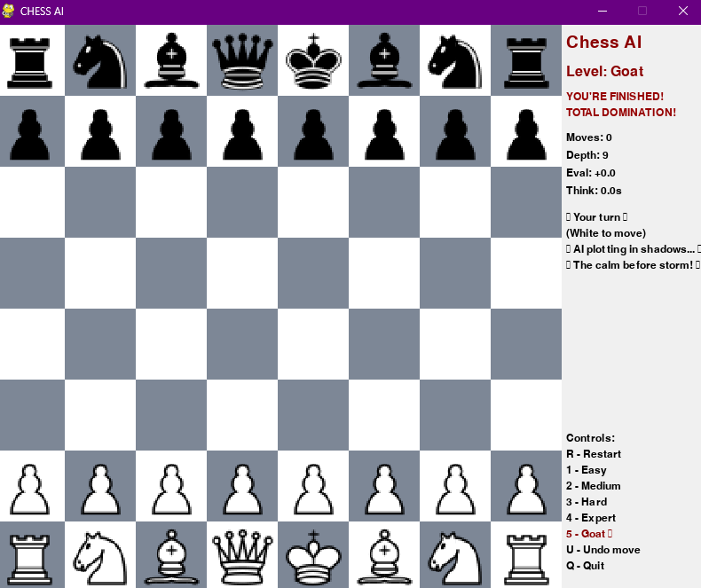

# ♟️CHESS AI 💀🔥

A feature-rich, high-performance chess game built with Python and Pygame. Take on the **ULTIMATE DESTROYER AI**—an AI opponent with multiple difficulty levels, including the insane **God Mode**! Whether you're a beginner or a grandmaster, prepare to be challenged.



---

## 🕹️ Features

✅ Beautifully rendered chessboard with piece graphics  
✅ Multiple AI difficulty levels: Easy → Expert → God  
✅ Smart move validation using `python-chess`  
✅ Real-time turn display and evaluation tracking  
✅ Game statistics: move count, depth, eval score, AI think time  
✅ Keyboard controls for restarting, undoing, and quitting  
✅ Stylish and interactive side panel with AI taunts & messages  
✅ Designed for an immersive experience with fast rendering and threading

---

## 🧠 AI Behavior

- **Level 1–2**: Random moves  
- **Level 3–4**: Semi-optimized using evaluation  
- **Level 5 (Goat Mode)**: Brutal move selection with deep depth (depth 9+)  
- AI uses `random`, `math`, and `time` for decision-making and smooth gameplay  
- Built on `python-chess` for legal move generation and board evaluation

---

## 🎮 Controls

| Key | Action               |
|-----|----------------------|
| R   | Restart Game         |
| 1   | Easy AI              |
| 2   | Medium AI            |
| 3   | Hard AI              |
| 4   | Expert AI            |
| 5   | God AI               |
| U   | Undo Move            |
| Q   | Quit Game            |

---

## 🛠️ Technologies Used

- `pygame` – GUI, rendering, and event loop  
- `python-chess` – Move generation, rules, and board logic  
- `random`, `math` – AI move selection logic  
- `time`, `threading` – Responsive performance and parallel thinking

---

## 🚀 Installation

### 1. Clone the Repository
```bash
git clone https://github.com/dasusmay/Ai-Chess-Game.git
cd Ai-Chess-Game


2.Install Dependencies

pip install pygame chess

3. Run the Game

python main.py


🧩 Future Improvements

🚀 Add sound effects and move animation

🚀 Highlight valid moves and last move

🚀 Online multiplayer support

🚀 Save/load functionality

🚀 Improve AI engine with minimax + alpha-beta pruning


👤 Author
Susmay Das
💻 Python Chess Enthusiast | Game Developer
🔗 Contributions, forks, and stars are welcome!

📄 License
Licensed under the MIT License.
Feel free to use and modify this project for learning and development purposes.
